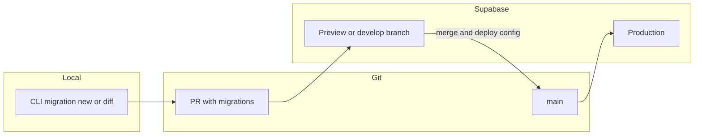

# Supabase branching, environments, and promotion

This document describes how Nomlog uses **Supabase Database Branching** (with GitHub), how to run the **app** and **API** against production vs develop, and how **database** and **API** changes reach production.

Official references: [Branching](https://supabase.com/docs/guides/deployment/branching), [GitHub integration](https://supabase.com/docs/guides/deployment/branching/github-integration), [Working with branches](https://supabase.com/docs/guides/deployment/branching/working-with-branches).

## 1. Dashboard: enable branching and GitHub

Complete these steps in the **production** Supabase project (dashboard). They cannot be done from this repo alone.

1. Enable **Database Branching** for the project (billing/plan dependent).
2. Go to **Project Settings → Integrations → GitHub**:
   - Authorize GitHub and select the Nomlog repository.
   - Set **Supabase directory** to: `nomlog-api/supabase` (monorepo path).
3. Recommended integration options:
   - **Automatic branching**: sync Git branches with Supabase branches (optional but useful).
   - **Deploy to production**: when ready, enable so merges to your production Git branch (e.g. `main`) apply pending **migrations** (and Edge Functions / storage declared in `config.toml`) to production. See [Deploying changes to production](https://supabase.com/docs/guides/deployment/branching/github-integration#deploying-changes-to-production).
4. In **GitHub → branch protection** for the target branch(es), add a **required status check** for the Supabase integration so failing migrations block merges. See [Preventing migration failures](https://supabase.com/docs/guides/deployment/branching/github-integration#preventing-migration-failures).

## 2. Persistent develop branch (staging)

For a **stable** develop/staging URL (not only ephemeral PR previews):

1. Create a long-lived Supabase branch (dashboard or CLI). With the CLI, from `nomlog-api`:

   ```bash
   supabase --experimental branches create --persistent
   ```

   Confirm the branch name (e.g. `develop`) when prompted.

2. Align it with your Git **`develop`** (or chosen) branch using the GitHub integration settings so pushes to that branch update the persistent branch.

3. Copy **branch-specific** credentials: Supabase dashboard → switch branch (dropdown) → **Settings → API** → Project URL and anon/service keys. Use these in local `.env.development` files (app + API) as described in the READMEs.

See also: [Branch configuration](https://supabase.com/docs/guides/deployment/branching/configuration) (`[remotes]` in `config.toml` for seeds and per-branch settings).

## 3. Migration and promotion workflow



1. **Author** SQL under `nomlog-api/supabase/migrations/` (timestamped files). Use `supabase migration new <name>` or `supabase db diff` after dashboard edits on a branch.
2. **Open a PR**: the integration applies migrations to the linked **preview** (or branch) database; fix failures before merge.
3. **Merge to production Git branch** (with **Deploy to production** enabled): pending migrations apply to production. Some dashboard-only config is **not** auto-deployed—check the [integration docs](https://supabase.com/docs/guides/deployment/branching/github-integration#deploying-changes-to-production).

**API code** (Express on Render, etc.) is **not** deployed by Supabase. Ship API changes via your normal CI/CD. Prefer **backward-compatible** DB and API changes first (expand/contract), then client updates if needed.

## 4. App and API: switching environments locally

- **App (`nomlog-app`)**: see [nomlog-app/README.md](../../nomlog-app/README.md) — from the monorepo root, `pnpm --filter nomlog-app run start:production` vs `pnpm --filter nomlog-app run start:develop` (scripts set `EXPO_APP_ENV`; `app.config.js` loads `.env.production` / `.env.development`, copy from `*.example` files). EAS profiles set `EXPO_APP_ENV` in `eas.json`.
- **API (`nomlog-api`)**: see [nomlog-api/README.md](../../nomlog-api/README.md) — `pnpm --filter nomlog-api run dev:production` vs `pnpm --filter nomlog-api run dev:develop` with the matching env files.

Each Supabase branch has its **own** URL and keys ([accessing branch credentials](https://supabase.com/docs/guides/deployment/branching/working-with-branches#accessing-branch-credentials)).

## 5. EAS builds and production smoke tests

- Configure **EAS** build profiles in `nomlog-app/eas.json` (`EXPO_APP_ENV` is set per profile). For **cloud** builds, set `EXPO_PUBLIC_API_URL`, `EXPO_PUBLIC_SUPABASE_URL`, and `EXPO_PUBLIC_SUPABASE_ANON_KEY` in [EAS environment variables](https://docs.expo.dev/eas/environment-variables/) (or secrets) per profile: **production** → prod Supabase + prod API; **preview** / **development** → develop branch + staging API if you have one.
- After migrating **production** DB and deploying **production** API, validate with an EAS **`production`** build (e.g. TestFlight) using **production** env vars—same as store-bound configuration.

## 6. Optional: staging API on Render

Duplicate the API service with environment variables pointing at the **develop** Supabase branch (URL + service role + anon keys). Production service keeps production Supabase credentials.
